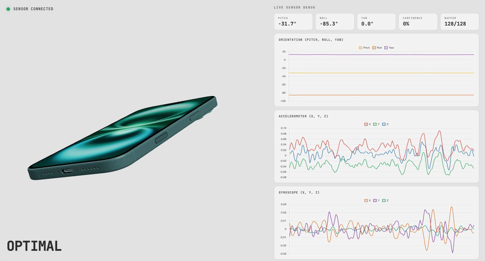

# HARper - 🏆 2nd Place Overall @ DataQuest '26

> Detect signs of injury and instability early all through the phone in your pocket

---

## Results

### Model Performance (Observed Data — Hold-Out Test Set)

| Metric | Score |
|---|---|
| Accuracy | 0.9368 |
| Precision | 0.8952 |
| Recall | 0.9737 |
| F1 Score | 0.9328 |
| RMSE | 0.2436 |

### Per-Class Breakdown

| Class | Precision | Recall | F1 Score | Support |
|---|---|---|---|---|
| Fresh (0) | 0.98 | 0.91 | 0.94 | 139 |
| Fatigued (1) | 0.90 | 0.97 | 0.93 | 114 |

### Curve Metrics

| Curve | AUC |
|---|---|
| ROC | 0.9748 |
| Precision-Recall | 0.9677 |

### Confusion Matrix

|  | Predicted Fresh | Predicted Fatigued |
|---|---|---|
| **Actual Fresh** | 126 | 13 |
| **Actual Fatigued** | 3 | 111 |

### Key Takeaways

- **97% recall on fatigued class** — the model rarely misses a fatigued athlete
- **Only 3 false negatives** — critical for a safety-oriented system
- **AUROC 0.97** — strong discriminative ability across all thresholds
- Test set is the **chronological last 20%** of each recorded session — zero data leakage

---

## What it builds

A real-time fatigue detection pipeline with three components:

| Component | Technology | Purpose |
|---|---|---|
| Sensor capture | Sensor Logger (iOS/Android) | Streams 6-channel IMU data over WiFi via HTTP Push |
| Inference server | Flask + TensorFlow/Keras | Buffers, preprocesses, and classifies movement in real time |
| Live dashboard | Three.js + Chart.js | 3D phone orientation, sensor charts, fatigue prediction display |

For each 128-sample window (~2.5 seconds), the system produces:
- Fatigue probability (0–1)
- Binary classification: **Optimal** or **Fatigued**
- Majority vote across last 10 windows (7/10 required to trigger alert)
- Live 3D orientation + accelerometer/gyroscope charts

---

## Architecture

```
Smartphone (Sensor Logger)
    │
    │  HTTP POST (WiFi)
    ▼
Flask Inference Server (server.py)
    │
    ├── Sensor Buffer (128 × 6 deque)
    │       │
    │       ▼
    ├── Preprocessing
    │       • Gravity subtraction (dedicated gravity sensor)
    │       • EMA smoothing (α = 0.3)
    │       • Z-score normalization (training mean/std)
    │       │
    │       ▼
    ├── 1D-CNN Inference (TensorFlow/Keras)
    │       │
    │       ▼
    └── Sliding Vote Filter (7/10 majority)
            │
            ▼
    3D Dashboard (Three.js + Chart.js)
        • Phone orientation
        • Acc/Gyro charts
        • Fatigue alert
```

---

## 1D-CNN Model

```
Input: (128, 6) — Acc X/Y/Z + Gyro X/Y/Z

Conv1D(64, k=5, ReLU) + BatchNorm + MaxPool(2)    ← micro-patterns: spikes, tremor
Conv1D(128, k=3, ReLU) + BatchNorm + MaxPool(2)   ← macro-patterns: gait rhythm, asymmetry

Flatten → Dense(64, ReLU) → Dropout(0.5) → Dense(1, Sigmoid)

Output: P(Fatigued) ∈ [0, 1]
```

### Regularization (small dataset — overfitting defense)

- L2 weight penalty (0.005) on all layers
- 50% Dropout before output
- EarlyStopping on val accuracy (patience 6)
- ReduceLROnPlateau (halve LR after 3 stale epochs)

### Why 1D-CNN over Transformer / LSTM

| Architecture | Inference Speed | Model Size | Fatigue Detection Fit |
|---|---|---|---|
| Transformer | Slow | Large | Overkill — fatigue is local, not long-range |
| LSTM | Moderate | Medium | Sequential processing bottleneck |
| **1D-CNN** | **<10ms** | **~3.3 MB** | **Purpose-built for local temporal patterns** |

Fatigue manifests as local features — impact spikes, tremor bursts, stride irregularity — exactly what convolutional filters detect.

---

## Dataset

### Phase 1 — Synthetic (Proof of Concept)

**UCI HAR Inertial Signals** — 30 subjects, 6 channels, 128-step windows.

- Walking activities (labels 1–3) → Class 0 (Fresh)
- Same data + synthetic corruption → Class 1 (Fatigued)
  - Gaussian noise (σ=0.1) on all channels → simulates muscle tremor
  - Top 10% acceleration peaks amplified 2–4× → simulates increased ground impact

### Phase 2 — Observed (Final Model)

**Custom recordings** via Sensor Logger on a real phone.

- 4 sessions: 2 × Fresh walking, 2 × Fatigued walking
- ~50 Hz sampling rate, 6 channels (Acc + Gyro)
- 80/20 chronological split per session — zero data leakage
- 128-sample sliding windows with 64-sample overlap (50%)

---

## Setup

```bash
pip install -r requirements.txt
```

Requires Python 3.9+ and TensorFlow.

---

## Train

### Phase 1 — Synthetic model (UCI HAR)

```bash
python train_model.py
```

Loads UCI HAR inertial signals, synthesizes fatigue, trains a 1D-CNN, and exports to `model/fatigue_model.keras`.

### Phase 2 — Observed model (real phone data)

```bash
python train_observed.py
```

Loads sessions from `observed-data/`, applies chronological split, trains a regularized 1D-CNN with EarlyStopping, and exports to `model/fatigue_model_observed.keras`.

---

## Run (Live Inference)

```bash
python server.py
```

1. Loads the trained model
2. Starts Flask server on `0.0.0.0:5143`
3. Prints the push URL for Sensor Logger

Then:
1. Install **Sensor Logger** on your phone (free, iOS/Android)
2. Configure HTTP Push to `http://<your-computer-ip>:5143/stream`
3. Ensure phone and computer are on the **same network**
4. Open `http://localhost:5143` in your browser for the live dashboard

---

## Evaluate


Run `evaluation_observed.ipynb` which produces:
- Accuracy, Precision, Recall, F1, RMSE
- Confusion matrix heatmap
- ROC curve with AUC
- Precision-Recall curve with AUC

---

## Key Design Decisions

- **Chronological split**: Each session is split 80/20 in time order — no future leakage
- **Z-score normalization**: Training mean/std computed on train set only, hardcoded into the server for live inference consistency
- **Gravity subtraction**: Uses the phone's dedicated gravity sensor, not a high-pass filter
- **EMA smoothing**: α=0.3 smooths sensor noise while preserving fatigue-relevant patterns
- **Majority vote**: 7 of last 10 windows must agree before triggering a fatigue alert — suppresses transient false positives
- **Stationary detection**: If accelerometer std < 0.05g, prediction is forced to "Optimal" — prevents false alerts when the phone is stationary

---

## Project Structure

```
HAR-InjuryRecognition/
├── data/                       # UCI HAR dataset (Phase 1)
│   ├── train/
│   │   └── Inertial Signals/
│   └── test/
│       └── Inertial Signals/
├── observed-data/              # Real phone recordings (Phase 2)
│   ├── class0-optimal*/        # Fresh walking sessions
│   └── class1-fatigue*/        # Fatigued walking sessions
├── model/
│   ├── fatigue_model.keras           # Phase 1 (synthetic)
│   └── fatigue_model_observed.keras  # Phase 2 (observed) — used by server
├── static/
│   ├── dashboard.js            # Three.js 3D scene + Chart.js graphs
│   └── dashboard.css
├── templates/
│   └── index.html              # Dashboard HTML
├── train_model.py              # Phase 1 training pipeline
├── train_observed.py           # Phase 2 training pipeline
├── server.py                   # Real-time inference server
├── evaluation_observed.ipynb   # Model evaluation + visualizations
└── requirements.txt
```

---

## Tech Stack

| Layer | Technology |
|---|---|
| Sensor capture | Sensor Logger (iOS/Android) |
| Server | Flask + Flask-CORS |
| ML framework | TensorFlow / Keras |
| Model | 1D-CNN (binary classifier, ~3.3 MB) |
| 3D visualization | Three.js |
| Charts | Chart.js |
| Data pipeline | NumPy, Pandas, scikit-learn |
